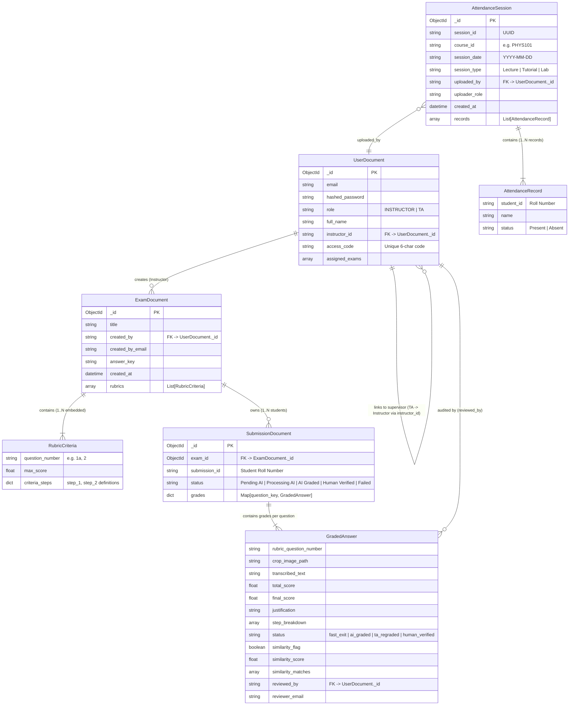

# GradeOps Architecture & Engineering Specification

> **Document Version:** 1.0.0  
> **Target Audience:** Core Maintainers, Systems Architects, and Engineering Contributors  
> **Status:** Production Architecture Specification

---

## Table of Contents

1. [Executive Summary & Technology Stack](#1-executive-summary--technology-stack)
   - [System Purpose & Domain](#system-purpose--domain)
   - [Full-Stack Architecture Matrix](#full-stack-architecture-matrix)
2. [Core Database Entities & Data Models](#2-core-database-entities--data-models)
   - [Entity-Relationship Architecture](#entity-relationship-architecture)
   - [Document Schemas & Field Definitions](#document-schemas--field-definitions)
   - [Tenant & Role Linking Dynamics](#tenant--role-linking-dynamics)
3. [The ML Pipeline & AI Systems](#3-the-ml-pipeline--ai-systems)
   - [Pipeline Evolution & ASAG Failure Modes](#pipeline-evolution--asag-failure-modes)
   - [Approach 1: Pure Vector Similarity (Vulnerabilities)](#approach-1-pure-vector-similarity-vulnerabilities)
   - [Approach 2: Two-Stage Decoupled Hybrid Gatekeeper](#approach-2-two-stage-decoupled-hybrid-gatekeeper)
   - [Approach 3: Unified Multimodal Collapse](#approach-3-unified-multimodal-collapse)
   - [Empirical 3-Way ASAG Benchmark Results](#empirical-3-way-asag-benchmark-results)
   - [Pairwise Anti-Collusion & Plagiarism Detection](#pairwise-anti-collusion--plagiarism-detection)
   - [Handwriting & Mathematical Derivation Handling](#handwriting--mathematical-derivation-handling)
4. [End-to-End Key Workflows](#4-end-to-end-key-workflows)
   - [Workflow 1: Bulk Examination Ingestion & Background Grading](#workflow-1-bulk-examination-ingestion--background-grading)
   - [Workflow 2: Dual-Path Attendance Ingestion & Shortage Projection](#workflow-2-dual-path-attendance-ingestion--shortage-projection)
   - [Workflow 3: TA Human-in-the-Loop Audit & Rapid Hotkeys](#workflow-3-ta-human-in-the-loop-audit--rapid-hotkeys)
5. [Role-Based Access Control (RBAC) & Security](#5-role-based-access-control-rbac--security)
   - [Authentication & JWT Token Lifecycle](#authentication--jwt-token-lifecycle)
   - [Role Permissions Matrix](#role-permissions-matrix)
   - [Multi-Tenant Data Isolation](#multi-tenant-data-isolation)
6. [Codebase Map & Directory Architecture](#6-codebase-map--directory-architecture)
   - [Directory Structure](#directory-structure)
   - [Core Modification Guide](#core-modification-guide)

---

## 1. Executive Summary & Technology Stack

### System Purpose & Domain
**GradeOps** is an enterprise-grade, **Human-in-the-Loop (HITL) AI-powered examination grading, plagiarism detection, and academic lifecycle management platform**. Designed specifically for collegiate STEM courses (engineering, physics, chemistry, and mathematics), GradeOps addresses the high latency, variance, and cognitive fatigue inherent in evaluating multi-step handwritten derivations and open-ended proofs.

```
                      ┌──────────────────────────────────────────────────────────┐
                      │                   GRADEOPS PLATFORM                      │
                      └────────────────────────────┬─────────────────────────────┘
                                                   │
         ┌─────────────────────────────────────────┼─────────────────────────────────────────┐
         ▼                                         ▼                                         ▼
┌──────────────────┐                     ┌──────────────────┐                     ┌──────────────────┐
│ Ingestion Engine │                     │   ML Pipeline    │                     │   TA Workbench   │
│  - Zip Unpacker  │                     │ - Unified VLM    │                     │ - Canvas Cropper │
│  - PyMuPDF Slice │                     │ - Fast-Exit Gate │                     │ - Rapid Hotkeys  │
│  - Space Cleanser│                     │ - Anti-Collusion │                     │ - Audit Locking  │
└──────────────────┘                     └──────────────────┘                     └──────────────────┘
```

Core capabilities include:
- **Bulk Examination Ingestion:** Ingests zipped archives of multi-page student exam PDFs, automatically sanitizes filename whitespace ("ghost spaces"), slices answer regions with PyMuPDF, and runs asynchronous batch grading.
- **Multimodal AI Grading Engine:** Evaluates complex multi-step mathematical derivations, physical sign conventions ($\Delta U = Q - W$, exothermic/endothermic polarities), and scientific schemas against granular JSON rubrics.
- **Human-in-the-Loop TA Workbench:** Offers an interactive canvas for Teaching Assistants to draw manual bounding box crops, re-run targeted AI evaluations, override scores/justifications, and lock finalized grades with audit logging.
- **Cross-Submission Anti-Collusion Engine:** Embeds student logic into high-dimensional vector spaces to compute pairwise cosine similarities across the entire cohort.
- **Attendance & Shortage Tracker:** Ingests CSVs, Excel rosters, or raw physical sign-in sheet scans (via Vision OCR) to calculate cumulative attendance and project the exact number of consecutive classes required to satisfy mandatory institutional cutoffs (e.g., the 75% attendance rule).

---

### Full-Stack Architecture Matrix

| Layer | Technology / Package | Version | Architectural Responsibility |
| :--- | :--- | :--- | :--- |
| **Frontend Core** | React (Vite environment) | `^18.3.1` (Vite `^5.4.2`) | Single Page Application (SPA) with hot module replacement and state management. |
| **Routing** | React Router DOM | `^6.26.2` | Client-side routing, protected auth routes, URL query synchronization. |
| **HTTP Client** | Axios | `^1.7.7` | Asynchronous communication with request interceptors for automated JWT injection. |
| **Iconography** | Lucide React | `^0.441.0` | Production UI icons across dashboards and toolbars. |
| **Backend Framework** | FastAPI | `>=0.110.0` | Asynchronous Python ASGI web framework with OpenAPI documentation. |
| **ASGI Server** | Uvicorn | `>=0.28.0` | High-performance asynchronous server running on Python 3.12. |
| **Database Driver** | Motor (AsyncIOMotorClient)| `>=3.3.2` | Non-blocking MongoDB asynchronous driver for coroutine concurrency. |
| **Validation & Schemas** | Pydantic v2 | `>=2.6.0` | Strict data validation, schema enforcement, and JSON schema extraction. |
| **PDF & Vision Processing**| PyMuPDF (`fitz`) | `>=1.23.0` | High-resolution PDF rasterization (`fitz.Matrix(2, 2)`), page image generation, and localized bounding-box slicing. |
| **Image Manipulation** | Pillow (PIL) | `>=10.2.0` | Image cropping, format conversion (PNG/JPEG), and in-memory byte buffer operations. |
| **Tabular Data** | Pandas & openpyxl | `pandas>=2.2.0`, `openpyxl>=3.1.2` | Ingestion of tabular CSV and Excel attendance rosters. |
| **Auth & Security** | Passlib + Bcrypt + PyJWT / Python-Jose | `bcrypt>=4.1.0`, `python-jose>=3.3.0` | Bcrypt password hashing (`gensalt`), JWT token encoding/decoding, role-based dependencies. |
| **Primary AI (VLM/LLM)** | Google Gemini (`gemini-2.5-flash`) | `google-genai>=0.1.0` | Unified Multimodal transcription & grading, agentic JSON rubric generation, multimodal attendance parsing. |
| **Vector Embeddings** | Google Gemini (`text-embedding-004`) | `google.generativeai` | 768-dimensional dense vector embeddings for Stage-1 coarse fast-exit filtering and pairwise anti-plagiarism. |
| **Fallback Inference** | Groq SDK | `groq>=0.9.0` | Zero-latency failover engine (`llama-4-scout-17b-16e-instruct` & `openai/gpt-oss-120b`) for rate-limit protection. |

---

## 2. Core Database Entities & Data Models

### Entity-Relationship Architecture



---

### Document Schemas & Field Definitions

#### 1. `UserDocument` (MongoDB Collection: `users`)
Defined in `backend/models/documents.py` and `backend/models/auth.py`:
- `_id`: Primary Key (`ObjectId`).
- `email`: Normalized lowercase user email address (`EmailStr`).
- `hashed_password`: Secure 60-character Bcrypt hash generated via `bcrypt.hashpw(password, gensalt())`.
- `role`: Role string (`INSTRUCTOR` or `TA`).
- `full_name`: Full display name of the educator.
- `access_code`: Unique 6-character uppercase alphanumeric code (e.g. `X7B9P2`) generated exclusively for `INSTRUCTOR` accounts during registration.
- `instructor_id`: String foreign key referencing `UserDocument._id` of the supervising professor (mandatory for `TA` registration).
- `assigned_exams`: List of exam identifiers assigned to this user.

#### 2. `ExamDocument` (MongoDB Collection: `exams`)
Defined in `backend/models/documents.py`:
- `_id`: Primary Key (`ObjectId`).
- `title`: User-defined exam title (e.g., `"Midterm 1: Thermodynamics"`).
- `created_by`: Foreign key storing the `_id` string of the creating instructor.
- `created_by_email`: Email string for legacy audit lookups.
- `answer_key`: Master answer key text or solutions reference.
- `created_at`: Creation timestamp (`datetime.utcnow`).
- `rubrics`: List of embedded `RubricCriteria` models.

#### 3. `RubricCriteria` (Embedded in `ExamDocument`)
- `question_number`: Question identifier (e.g., `"1a"`, `"2"`, `"Q3"`).
- `max_score`: Total maximum score for this question (float).
- `criteria_steps`: Rich JSON mapping step identifiers to point allocations and requirements:
  ```json
  {
    "step_1": { "description": "State the conservation of energy law.", "points": 5.0 },
    "step_2": { "description": "Provide formula dU = Q - W and define variables.", "points": 5.0 }
  }
  ```

#### 4. `SubmissionDocument` (MongoDB Collection: `submissions`)
Defined in `backend/models/documents.py`:
- `_id`: Primary Key (`ObjectId`).
- `exam_id`: Foreign key referencing the parent `ExamDocument._id` (`ObjectId`).
- `submission_id`: Clean student roll number or PDF identifier (e.g., `"230103128"`).
- `status`: Lifecycle state string (`"Pending AI"`, `"Processing AI"`, `"AI Graded"`, `"Human Verified"`, `"Failed"`).
- `is_fully_reviewed`: Boolean flag indicating whether all questions have been reviewed.
- `grades`: Key-value mapping of question identifiers to `GradedAnswer` models.

#### 5. `GradedAnswer` (Embedded inside `SubmissionDocument.grades`)
- `rubric_question_number`: Question identifier (e.g., `"1a"`).
- `crop_image_path`: Absolute file path on disk to the sliced PNG crop.
- `transcribed_text`: Raw handwritten OCR / LaTeX transcription.
- `total_score` / `ai_score`: Score calculated by AI proposal engine.
- `justification` / `ai_justification`: Step-by-step reasoning string for points awarded/deducted.
- `step_breakdown`: Granular array of `StepScore` items (`step_id`, `criterion_met`, `points_awarded`, `comment`).
- `status`: Question status (`"fast_exit"`, `"ai_graded"`, `"ta_regraded"`, `"human_verified"`).
- `similarity_flag` / `plagiarism_flag`: Boolean alert for cross-submission collusion.
- `similarity_score`: Max pairwise cosine similarity score (0.0 to 1.0).
- `similarity_matches`: Array of student roll numbers matching this submission.
- `final_score`: Overridden score locked by human TA.
- `final_justification`: Overridden explanation locked by human TA.
- `reviewed_by`: `_id` string of the auditing TA/Instructor.
- `reviewer_email`: Email string of the auditing TA/Instructor.

#### 6. `AttendanceSession` (MongoDB Collection: `attendance_sessions`)
Defined in `backend/models/attendance.py`:
- `_id`: Primary Key (`ObjectId`).
- `session_id`: Unique UUIDv4 string.
- `course_id`: Course or subject code (e.g., `"PHYS101"`, `"CS101"`).
- `session_date`: Date string in `YYYY-MM-DD` format.
- `session_type`: Type of session (`"Lecture"`, `"Tutorial"`, `"Lab"`).
- `uploaded_by`: User ID string of the uploader.
- `uploader_role`: Role of the uploader (`"INSTRUCTOR"` or `"TA"`).
- `created_at`: Creation timestamp.
- `records`: List of embedded `AttendanceRecord` objects (`student_id`, `name`, `status`).

---

## 3. The ML Pipeline & AI Systems

GradeOps processes handwritten engineering papers where semantic nuance and mathematical derivations are paramount. The ML pipeline underwent a critical architectural evolution to optimize accuracy and throughput.

```
═══════════════════════════════════════════════════════════════════════════════════════════════════════
EVOLUTION OF THE GRADEOPS GRADING PIPELINE
═══════════════════════════════════════════════════════════════════════════════════════════════════════

1. BASELINE: Decoupled Multi-Pass (OCR -> NLI Reasoner)
   [PDF Crop] ──> [Gemini 2.5 Flash (OCR)] ──> [Gemini 2.5 Flash (NLI + Rubric)] ──> 2 API calls / crop

2. IMPROVEMENT 1: Two-Stage Decoupled Hybrid Gatekeeper
   [Student Text] ──> [Stage 1: text-embedding-004] ──(Sim < 0.40)──> Fast Exit: 0 pts, 0 tokens (< 40ms)
                             │
                     (Sim >= 0.40)
                             ▼
                      [Stage 2: Gemini 2.5 Flash (NLI Reasoning)] ──> Granular Partial Credit

3. IMPROVEMENT 2: Unified Multimodal Collapse (Production Default)
   [PDF Image Crop] + [Rubric] + [Key] ──> [Gemini 2.5 Flash] ──> Single Atomic JSON Response
   (Transcribes LaTeX & calculates rubric steps simultaneously: 1 API call / crop = 50% Reduction)
═══════════════════════════════════════════════════════════════════════════════════════════════════════
```

---

### Pipeline Evolution & ASAG Failure Modes

#### Approach 1: Pure Vector Similarity (Vulnerabilities)
Using dense vector embeddings alone (Bi-Encoders) to evaluate student responses against reference keys introduces severe failure modes in academic grading:
1. **The Negation Blind Spot:** A student writing *"Energy can be created and destroyed"* shares $>90\%$ lexical and semantic overlap with the First Law of Thermodynamics. Bi-encoders project both into almost identical vector directions ($\text{cosine similarity} > 0.88$), awarding false full marks to inverted physics.
2. **Sign/Polarity Inversion:** Thermodynamic signs ($\Delta H = +45\text{ kJ}$ vs. $\Delta H = -45\text{ kJ}$) or kinematic directions create negligible vector distance shifts despite indicating opposing physical phenomena.
3. **Keyword Salad:** Unstructured streams of technical terminology achieve artificially high centroid alignments despite zero coherent reasoning.

---

### Approach 2: Two-Stage Decoupled Hybrid Gatekeeper
Implemented in `backend/ml_pipeline/grading/engine.py` (`evaluate_answer`):

```text
              [Transcribed Student Answer]
                           │
                           ▼
    [Stage 1: Coarse Vector Gatekeeper (Bi-Encoder)]
   Cosine Similarity vs. Professor Key (text-embedding-004)
                           │
        ┌──────────────────┴──────────────────┐
        ▼                                     ▼
 Similarity < 0.40                     Similarity >= 0.40
(Blank / Unrelated / Gibberish)               │
        │                                     ▼
        │                     [Stage 2: Fine Logic Check (NLI)]
        │                     Cross-Attention via gemini-2.5-flash
        │                     Step-by-Step Rubric Reasoning & Signs
        │                                     │
        ▼                                     ▼
Auto-Assign 0/10                     Granular Partial Credit
(Fast Exit: < 40ms, $0)                  Awarded with Justification
```

- **Rule A (Trivial Response):** Answers with $< 3$ words are flagged as blank/unattempted and fast-exited with 0 points and 0 tokens.
- **Rule B (Stage 1 Vector Gatekeeper):** The transcribed text is converted to a 768-dim dense embedding via `text-embedding-004`. If cosine similarity against the reference key is $< 0.40$, it exits instantly with 0 points in $< 40\text{ms}$.
- **Rule C (Stage 2 Deep NLI Reasoning):** Submissions passing Stage 1 ($\ge 0.40$) are dispatched to `gemini-2.5-flash` with the master rubric for cross-attention evaluation of algebraic steps and sign conventions.

---

### Approach 3: Unified Multimodal Collapse
Implemented in `backend/ml_pipeline/grading/engine.py` (`grade_crop_multimodal`):
- Instead of executing two separate API calls (OCR followed by NLI reasoning), GradeOps passes the raw PNG crop image, reference key, and JSON rubric to `gemini-2.5-flash` in a **single atomic multimodal call**.
- **Benefits:**
  1. **50% Call Reduction:** Drops API calls from $2 \times N \times Q$ to $1 \times N \times Q$ ($50 \rightarrow 25$ network requests for a 5-student, 5-question batch).
  2. **Eliminates Transcription Loss:** Gemini inspects handwriting, sketches, and mathematical notation directly in pixel space.
  3. **Structured JSON Guarantee:** Enforced via `response_mime_type="application/json"` and `response_schema=UnifiedGradingResult`.

---

### Empirical 3-Way ASAG Benchmark Results
Validated via `backend/benchmark_grading.py` across 5 canonical ASAG archetypes (*Exact Match*, *Valid Paraphrase*, *Direct Contradiction / Sign Inversion*, *Keyword Salad*, and *Off-Topic*):

| Metric | Approach 1: Pure Cosine Sim (`text-embedding-004`) | Approach 2: Two-Stage Decoupled (`text-embedding-004` + LLM) | Approach 3: Unified Multimodal (`gemini-2.5-flash`) | Engineering Verdict |
| :--- | :---: | :---: | :---: | :--- |
| **Quadratic Weighted Kappa (QWK)** | 0.447 *(Weak)* | **0.996 *(Near-Perfect)*** | **0.996 *(Near-Perfect)*** | Approaches 2 & 3 match human grading consistency. |
| **Pearson Correlation ($r$)** | 0.844 | **0.996** | **0.996** | Strict linear calibration. |
| **Mean Absolute Error (MAE / 10)** | $\pm 3.51$ pts | **$\pm 0.30$ pts** | **$\pm 0.30$ pts** | Reduces error by 3.21 points over vector-only. |
| **Contradiction False Positives ($\text{FPR}_{\text{contra}}$)** | 100.0% *(Critical Failure)* | **0.0% *(Robust)*** | **0.0% *(Robust)*** | Completely eliminates false credit on negated physics laws. |
| **API Network Requests per Crop** | 1 call | 2 calls | **1 call** | **50% reduction in external network latency.** |

---

### Pairwise Anti-Collusion & Plagiarism Detection
Implemented in `backend/ml_pipeline/grading/similarity.py` (`run_similarity_check`):

$$\text{Cosine Similarity}(\mathbf{u}, \mathbf{v}) = \frac{\mathbf{u} \cdot \mathbf{v}}{\|\mathbf{u}\|_2 \|\mathbf{v}\|_2} = \frac{\sum_{i=1}^{768} u_i v_i}{\sqrt{\sum_{i=1}^{768} u_i^2} \sqrt{\sum_{i=1}^{768} v_i^2}}$$

1. **Cohort Grouping:** Fetches all submissions for an exam and groups transcribed answers by question key.
2. **Embedding Generation:** Generates 768-dimensional dense vectors via `text-embedding-004` for all substantive student answers ($>5$ chars).
3. **Pairwise Comparison:** Computes pairwise cosine similarity across all student combinations for that question.
4. **Flagging & Linking:** If similarity $\ge 0.85$, flags both submissions (`similarity_flag: true`, `plagiarism_flag: true`), records matching roll numbers in `similarity_matches`, and persists updates to MongoDB.
5. **TA Warning UI:** In the Workbench, matching answers display yellow warning banners with clickable links to directly inspect the matched peer submission.

---

### Handwriting & Mathematical Derivation Handling
1. **High-Resolution PyMuPDF Slicing:** Pages are rasterized with a $2\times$ scale matrix (`fitz.Matrix(2, 2)`), producing clean 144+ DPI PNG crops without pixelation.
2. **LaTeX Equation Extraction:** Gemini prompt explicitly commands mathematical derivations to be transcribed in standard LaTeX syntax (e.g. `\Delta U = Q - W`, `\int_a^b f(x) dx`).
3. **Mathematical Equivalence Checking:** The evaluation prompt commands the engine to award full marks if a student arrives at the correct solution via an alternate mathematically sound derivation.
4. **Resilient Failover:** If Gemini hits rate limits (`429 Too Many Requests`), the pipeline routes to Groq (`meta-llama/llama-4-scout-17b-16e-instruct` or `openai/gpt-oss-120b`).

---

## 4. End-to-End Key Workflows

### Workflow 1: Bulk Examination Ingestion & Background Grading

```
[Instructor] Uploads Title + Rubric JSON + submissions.zip
    │
    ▼
POST /api/exams/initialize (RoleChecker: INSTRUCTOR)
    │
    ├─► 1. Inserts ExamDocument in MongoDB ("exams" collection)
    ├─► 2. Unpacks ZIP to data/uploads/{exam_id}/extracted/
    ├─► 3. Ghost-Space Sanitizer: Cleans filenames (" Arnav .pdf" -> "Arnav.pdf")
    ├─► 4. Pre-populates Submissions in MongoDB ("status": "Pending AI")
    │
    ▼
FastAPI BackgroundTasks: process_submissions_worker()
    │
    ├─► Iterates each student PDF
    │     │
    │     ├─► PyMuPDF slice_single_crop() renders local PNG (fitz.Matrix(2,2))
    │     │
    │     └─► grading_engine.grade_crop_multimodal() (Gemini 2.5 Flash)
    │           - Transcribes LaTeX
    │           - Grades step_1, step_2 criteria
    │           - Generates points & justification
    │
    ▼
MongoDB Update: status = "AI Graded", grades = { "1a": { total_score, justification, ... } }
```

1. **Endpoint Ingestion:** Instructor submits `title`, `rubric_json`, and `.zip` file via `POST /api/exams/initialize`.
2. **Sanitization:** Ghost-space sanitizer strips leading/trailing whitespace from PDF filenames on disk to eliminate URL routing errors.
3. **Ledger Initialization:** Pre-inserts records into the `submissions` collection with status `"Pending AI"`.
4. **Worker Execution:** `process_submissions_worker` executes in the background. It uses `VisionExtractor.slice_single_crop` to produce high-resolution crops, then invokes `grade_crop_multimodal` to compute scores, updating MongoDB to `"AI Graded"`.

---

### Workflow 2: Dual-Path Attendance Ingestion & Shortage Projection

```
[Instructor/TA] Uploads CSV, XLSX, or Scanned Image/PDF
    │
    ▼
POST /api/attendance/{course_id}/upload
    │
    ├─► Tabular: AttendanceService.parse_tabular_file() (Pandas / Built-in CSV)
    │   OR
    ├─► Scanned Sheet: AttendanceService.parse_scanned_sheet_multimodal() (Gemini Vision)
    │
    ▼
MongoDB: Inserts AttendanceSession record into "attendance_sessions"
    │
    ▼
AttendanceService.calculate_course_summary()
    │
    ├─► Computes attended_sessions (A) and total_sessions (T)
    ├─► Attendance Percentage: P = (A / T) * 100
    ├─► Shortage Check: is_shortage = (P < 75.0%)
    │
    ├─► Minimum Classes Needed to Reach 75%:
    │   (A + k) / (T + k) >= 0.75  ==>  k = max(0, ceil(3*T - 4*A))
    │
    ▼
UI Rendering (AttendanceLedger.jsx):
    - P >= 75%: Green Badge [✓ Eligible (Safe)]
    - P <  75%: Red Badge [⚠️ Shortage (<75%)] + "Must attend next k classes"
```

- **Mathematical Derivation of Classes Needed ($k$):**
  $$\frac{A + k}{T + k} \ge 0.75 = \frac{3}{4} \implies 4(A + k) \ge 3(T + k) \implies 4A + 4k \ge 3T + 3k \implies k \ge 3T - 4A$$
  $$\therefore k = \max(0, \lceil 3T - 4A \rceil)$$
- **UI Presentation (`AttendanceLedger.jsx`):** Displays color-coded progress bars (Green $\ge 75\%$, Amber $65-74\%$, Red $<65\%$), real-time search filters, and one-click CSV export.

---

### Workflow 3: TA Human-in-the-Loop Audit & Rapid Hotkeys

```
[TA] Opens ReviewDashboard (/runner?exam={id}&student={sid})
    │
    ├─► Loads submission details from GET /api/exams/{id}/submissions/{sid}
    ├─► Renders raw PDF page via GET /api/exams/{id}/submissions/{sid}/pages/0
    │
    ├─► [Optional Visual Re-crop]:
    │   TA draws bounding box on Canvas -> clicks "Force AI Re-Evaluation"
    │   POST /api/exams/{id}/submissions/{sid}/regrade/{q_key}
    │
    ├─► [Manual Overrides]:
    │   TA modifies numerical score or justification textarea directly
    │
    ├─► [Lock & Commit]:
    │   TA clicks "Accept & Lock Grade" (or presses Enter / 'A' hotkey)
    │   PUT /api/exams/{id}/submissions/{sid}/commit
    │   MongoDB updates: status = "human_verified", reviewed_by = TA_ID
    │
    └─► Automatically advances to the next student in the ledger
```

#### Rapid TA Keyboard Hotkeys (`ReviewDashboard.jsx`)
To achieve high grading throughput, the TA Workbench implements global keyboard accelerators (guarded against active text input focus):
- <kbd>Enter</kbd> or <kbd>A</kbd>: Accept current grade, lock in database, and advance to the next student.
- <kbd>→</kbd> or <kbd>J</kbd>: Next student submission.
- <kbd>←</kbd> or <kbd>K</kbd>: Previous student submission.
- <kbd>↑</kbd> or <kbd>W</kbd>: Previous question for active student.
- <kbd>↓</kbd> or <kbd>S</kbd>: Next question for active student.
- <kbd>E</kbd>: Instantly focus and select the manual numerical score input field.

---

## 5. Role-Based Access Control (RBAC) & Security

### Authentication & JWT Token Lifecycle
1. **Password Hashing:** Passwords are salted and hashed via Bcrypt (`bcrypt.hashpw`).
2. **Token Generation:** `create_access_token` generates an HS256 JWT containing subject (`email`), role (`INSTRUCTOR` or `TA`), and expiration timestamp.
3. **Axios Request Interceptor:** The frontend Axios client interceptor dynamically injects `Authorization: Bearer <access_token>` into every outgoing HTTP request.
4. **FastAPI Bouncer (`get_current_user`):** Decodes JWT tokens, checks user existence in MongoDB, and normalizes user roles.
5. **RBAC Guard (`RoleChecker`):** Validates that `current_user["role"]` matches required endpoint permissions.

---

### Role Permissions Matrix

| Capability / Endpoint | Route Pattern | `INSTRUCTOR` | `TA` | `STUDENT` |
| :--- | :--- | :---: | :---: | :---: |
| **Account Registration** | `POST /api/auth/register` | Open (Generates `access_code`) | Requires valid `access_code` | N/A |
| **Authentication** | `POST /api/auth/login` | Allowed | Allowed | N/A |
| **View Exams List** | `GET /api/exams` | Owned exams only | Supervisor's exams only | None |
| **Initialize Exam & Batch ZIP** | `POST /api/exams/initialize` | **Allowed** | **Forbidden (403)** | **Forbidden** |
| **Upload Late Student PDF** | `POST /api/exams/{id}/single-upload`| **Allowed** | **Forbidden (403)** | **Forbidden** |
| **Delete Exam & Submissions** | `DELETE /api/exams/{id}` | **Allowed** | **Forbidden (403)** | **Forbidden** |
| **Generate AI Rubric** | `POST /api/exams/generate-rubric` | **Allowed** | **Forbidden (403)** | **Forbidden** |
| **Trigger Plagiarism Check** | `POST /api/exams/{id}/run-plagiarism-check` | **Allowed** | **Forbidden (403)** | **Forbidden** |
| **View TA Team Analytics** | `GET /api/team/activity` | **Allowed** | **Forbidden (403)** | **Forbidden** |
| **Access Class Ledger** | `GET /api/exams/{id}/roster` | Allowed | Allowed | None |
| **Workbench Page Crop & Regrade**| `POST /api/exams/{id}/submissions/{sid}/regrade/{q}` | Allowed | Allowed | None |
| **Lock Human-Verified Grade** | `PUT /api/exams/{id}/submissions/{sid}/commit` | Allowed | Allowed | None |
| **Upload Attendance Sheet** | `POST /api/attendance/{course_id}/upload` | Allowed | Allowed | None |
| **Export Attendance CSV** | `GET /api/attendance/{course_id}/export` | Allowed | Allowed | None |

---

### Multi-Tenant Data Isolation
- **Instructors** query exams filtered by `{"created_by": user_id}`.
- **Teaching Assistants** query exams filtered by `{"created_by": instructor_id}` (derived from their registration access code).

---

## 6. Codebase Map & Directory Architecture

### Directory Structure

```text
gradeops/
├── backend/
│   ├── api/
│   │   ├── dependencies.py             # Security dependency re-exports
│   │   └── routes/
│   │       ├── auth.py                 # Registration (access code linking), login, /me profile
│   │       ├── exams.py                # Ingestion (/initialize), late PDF, regrading, commits, deletion
│   │       ├── attendance.py           # Attendance sheet upload, 75% summaries, session overrides
│   │       └── team.py                 # Professor TA throughput metrics & activity aggregation
│   ├── core/
│   │   ├── database.py                 # Async Motor MongoDB connection & ping_database helper
│   │   └── security.py                 # Bcrypt password hashing, JWT encoder, get_current_user, RoleChecker
│   ├── ml_pipeline/
│   │   ├── vision/
│   │   │   └── extractor.py            # PyMuPDF PDF page rasterization and local crop slicing
│   │   └── grading/
│   │       ├── engine.py               # Multimodal Collapse & Two-Stage Gatekeeper grading engine
│   │       ├── rubric_agent.py         # Agentic JSON rubric generator from raw exam & answer keys
│   │       └── similarity.py           # text-embedding-004 pairwise anti-plagiarism & logic similarity
│   ├── models/
│   │   ├── auth.py                     # UserCreate, UserInDB, Token schemas
│   │   ├── documents.py                # UserDocument, ExamDocument, SubmissionDocument, GradedAnswer
│   │   └── attendance.py               # AttendanceSession, AttendanceRecord, StudentAttendanceSummary
│   ├── services/
│   │   └── attendance_service.py       # Tabular & Gemini multimodal attendance parsing + 75% shortage math
│   ├── benchmark_grading.py            # Canonical 3-way ASAG benchmarking suite & statistical validator
│   └── main.py                         # FastAPI ASGI app, CORS middleware, static crop mounting
│
└── frontend/
    ├── src/
    │   ├── services/
    │   │   └── api.js                  # Central Axios instance with JWT interceptor & service methods
    │   ├── pages/
    │   │   ├── Login.jsx               # University login screen
    │   │   ├── Register.jsx            # Dual-role signup (generates instructor code / validates TA code)
    │   │   ├── Dashboard.jsx           # Command Center: active exams, TA metrics table, delete actions
    │   │   ├── SetupPortal.jsx         # Ingestion gateway, Dual-Path Rubric Synthesizer, ZIP dropzone
    │   │   ├── ReviewDashboard.jsx     # TA Workbench: interactive canvas cropper, score override, hotkeys
    │   │   ├── RosterDashboard.jsx     # Class Ledger: verification statuses, CSV grade exporter
    │   │   ├── InsightsDashboard.jsx   # Analytics visualizer: class averages, max/min, question bell curves
    │   │   └── AttendanceLedger.jsx    # Attendance tracker: 75% shortage badges, session upload modal
    │   └── App.jsx                     # Top-level client router & auth state provider
    ├── package.json                    # Frontend dependencies (React 18, Vite, Axios, Lucide)
    └── vite.config.js                  # Vite configuration & dev server ports
```

---

### Core Modification Guide

- **To adjust AI Grading prompts or criteria logic:** Edit `backend/ml_pipeline/grading/engine.py`.
- **To modify bounding-box PDF cropping resolutions:** Edit `backend/ml_pipeline/vision/extractor.py`.
- **To adjust the 75% attendance shortage threshold or calculation:** Edit `backend/services/attendance_service.py`.
- **To add new role permissions or protected endpoints:** Edit `backend/core/security.py` and `backend/api/routes/`.
- **To enhance the TA Workbench review canvas or keyboard shortcuts:** Edit `frontend/src/pages/ReviewDashboard.jsx`.
